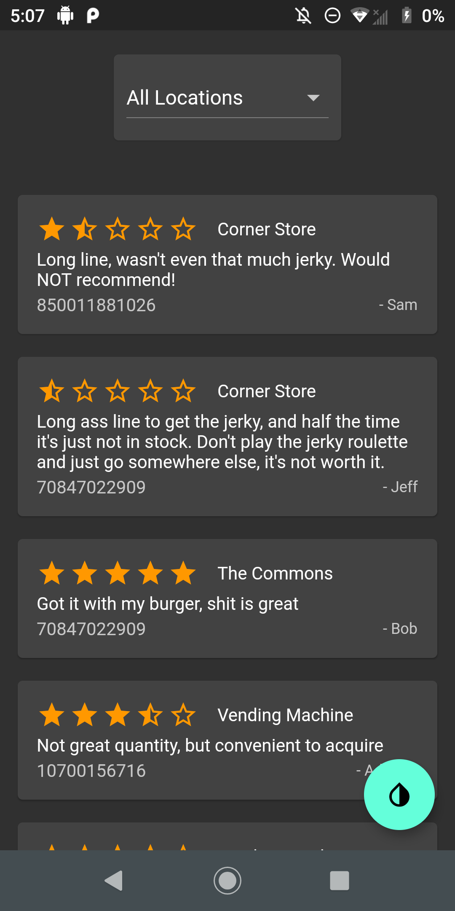

# Rate My Jerky
Rate My Jerky is a hackathon project for Clayhack. This is one of two repos, the other being the backend at [RubbaBoy/RateMyJerkyBackend](https://github.com/RubbaBoy/RateMyJerkyBackend). This solves the problem of not being sure what the best beef jerky is, or the best place to get beef jerky at RIT. There are half a dozen locations (not including all vending machines) to get beef jerky, and with a high price mark, it often leaves students puzzles and worried, not being sure where their next source of good beef jerky is going to come from.

Rate My Jerky is a mobile app that allows you to simply scan your beef jerky barcode, give a name, location, and star rating/description of your jerky experience to publish to the master list of beef jerky reviews. Everyone's reviews can then be viewed by a location filter, or all locations at once if you are really looking out for the best jerky. With a light/dark theme toggle, you can't go wrong.

_[(For a much longer description of the project, check out the devpost page about it)](https://devpost.com/software/rate-my-jerky)_

## Features

- An easy to use, clean interface
- Barcode scanning for your jerky
- Comprehensive listing and filtering
- All beef jerky supplying locations at RIT
- Dark/Light theme toggle

### Screenshots

       